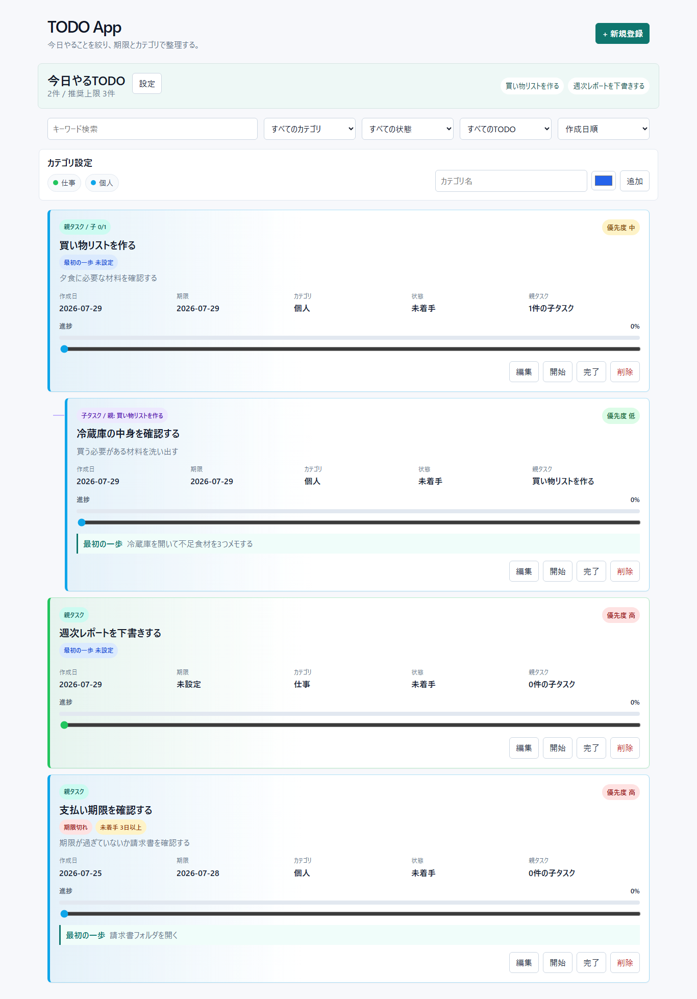
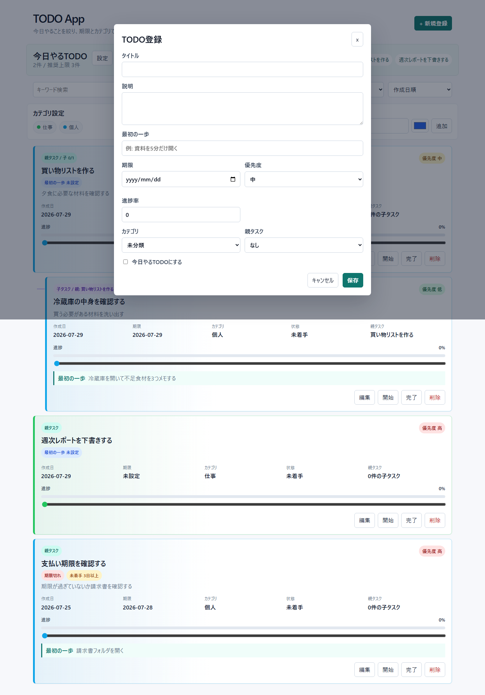
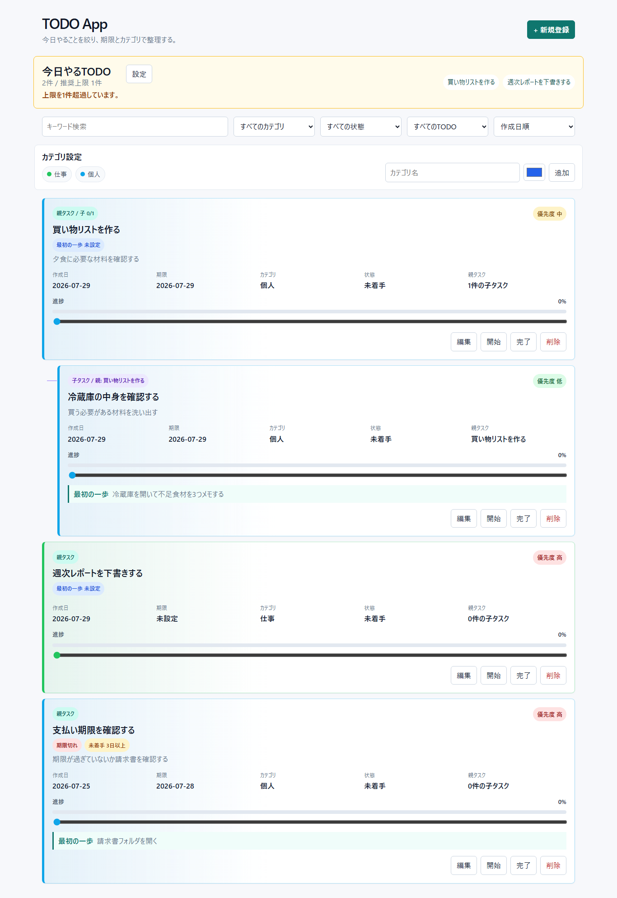
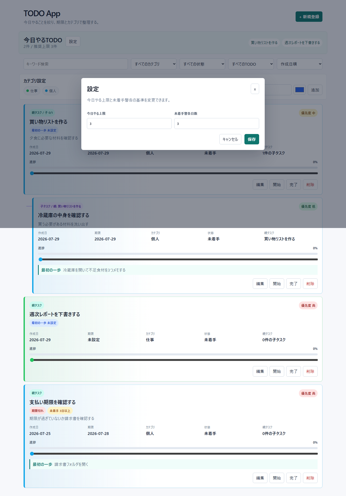
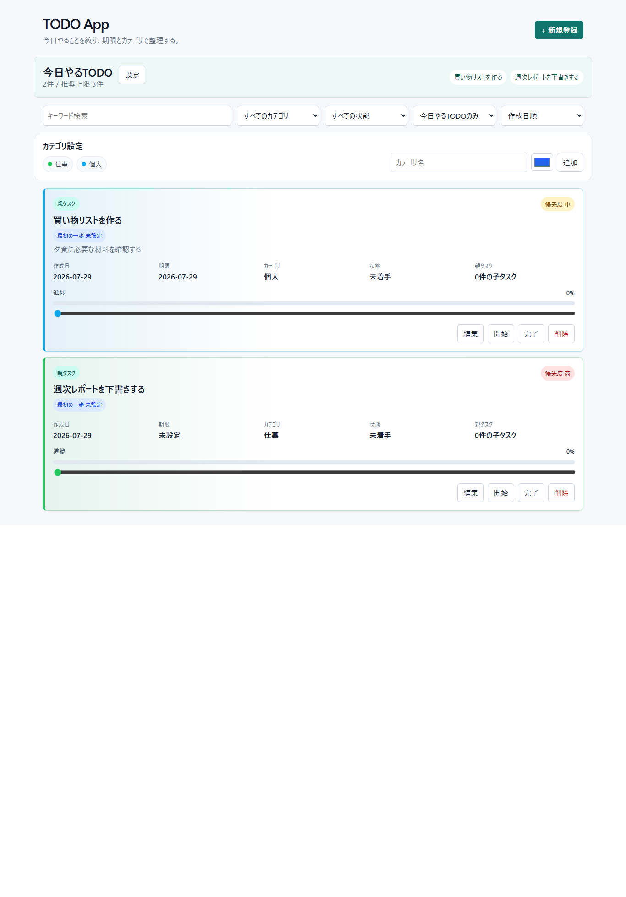
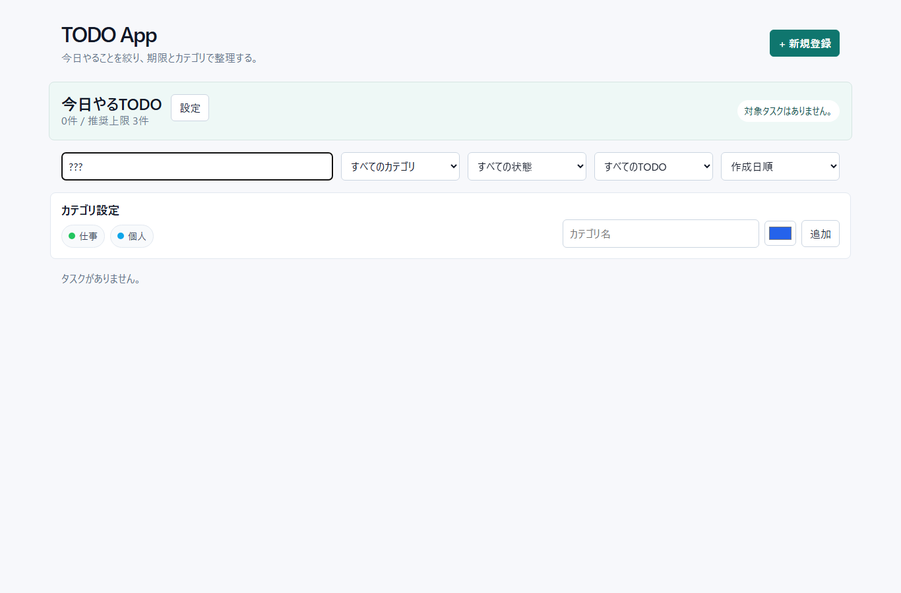
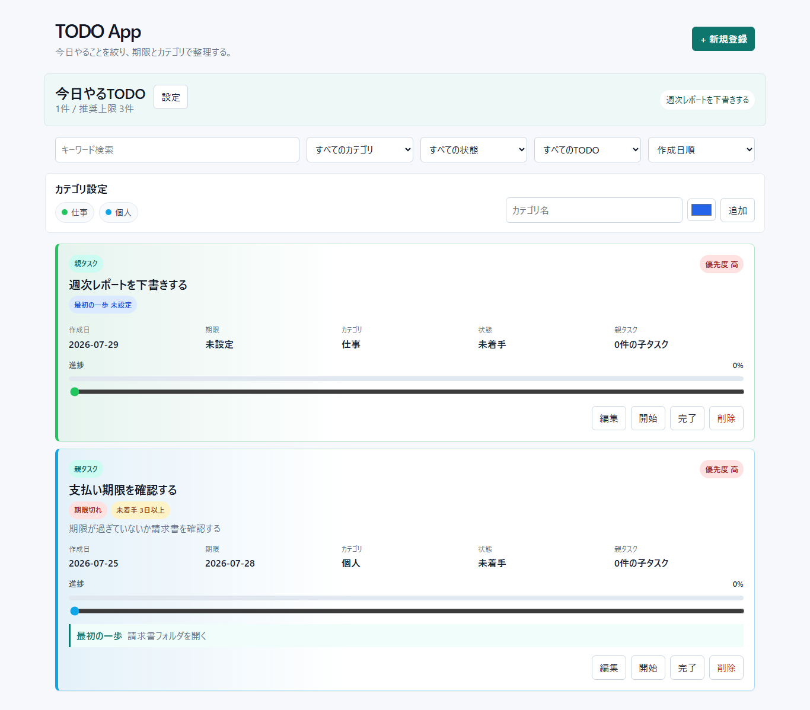
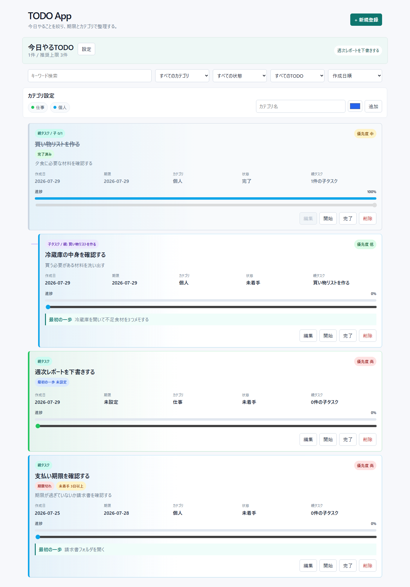

# TODO App

2026年度 技術カンファレンス登壇用TODOアプリケーションです。

タスクを登録して満足してしまう状態を抑えるため、通常のTODO管理に加えて「最初の一歩」「今日やるTODOの上限」「未着手警告」「親子タスク」「手入力の進捗率」を扱えます。

## 起動方法

Docker Composeでフロントエンドとバックエンドをまとめて起動します。

```powershell
docker compose up -d --build
```

起動後、ブラウザで以下を開きます。

```text
http://localhost:5173/
```

停止する場合は以下を実行します。

```powershell
docker compose down
```

## 画面全体

一覧画面では、今日やるTODO、検索・フィルタ、カテゴリ設定、タスクカードをまとめて確認できます。



## TODOを登録する

画面右上の「新規登録」からTODO登録モーダルを開きます。

入力できる主な項目:

- タイトル
- 説明
- 最初の一歩
- 期限
- 優先度
- 進捗率
- カテゴリ
- 親タスク
- 今日やるTODOにするか



「最初の一歩」には、登録後すぐ実行できる具体的な行動を入力します。


## 今日やるTODOを使う

「今日やるTODO」にチェックした未完了タスクは、画面上部の今日やるTODOエリアに表示されます。

今日やる件数が多くなりすぎると、推奨上限の警告が表示されます。



「設定」ボタンから、今日やるTODOの上限と未着手警告の日数を変更できます。



## 検索・フィルタを使う

キーワード検索は、以下を対象に部分一致で検索します。

- タイトル
- 説明
- 最初の一歩

カテゴリ、状態、今日やるTODO、並べ替えも同じエリアから変更できます。



親タスクが検索結果に含まれず、子タスクだけが表示される場合でも、子タスクには親タスク名が表示されます。



## 親子タスクを確認する

タスクカードには、親タスクか子タスクかがラベルで表示されます。

親タスクには子タスク数と完了済み子タスク数が表示され、子タスクには親タスク名が表示されます。


親タスクを削除すると、紐づく子タスクも削除されます。削除前には確認ダイアログが表示されます。



## 進捗率を変更する

タスクカードの進捗バーを直接スライドすると、進捗率を変更できます。

進捗率を100%にすると、状態は自動的に完了になります。完了済みタスクは編集ボタンと進捗バーが無効になります。


## 完了済みタスクを見分ける

完了済みタスクは「完了済み」ラベル、取り消し線、無効化された編集ボタンで見分けられます。

カテゴリ色はタスクカードの枠線や背景にも反映されます。



## データ保存について

現在の実装はインメモリ保存です。

Dockerコンテナやバックエンドプロセスを再起動すると、登録したTODOは初期データに戻ります。永続化は未導入です。

## 主なコマンド

```powershell
npm run test:backend
npm run test:frontend
npm run build
```

Windowsローカル環境では `vite build` が環境依存で失敗する場合があります。その場合でも、Docker内では以下でビルド確認できます。

```powershell
docker compose exec -T frontend npm run build -w frontend
docker compose exec -T backend npm run build -w backend
```
