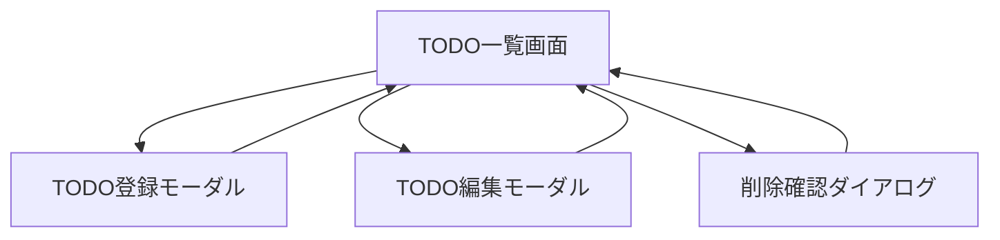

# Step3：画面設計書

## 画面遷移



## TODO一覧画面ワイヤーフレーム

```text
+------------------------------------------------------------+
| TODOアプリ                                                  |
+------------------------------------------------------------+
| [検索] [カテゴリ] [今日やる] [期限切れ] [+ TODO追加]          |
+------------------------------------------------------------+
| 全体進捗：██████░░░░ 60%                                    |
+------------------------------------------------------------+
| 今日やるTODO                                                |
| ☐ 設計書を作成する [編集] [削除]                             |
|   まずやること：画面構成を箇条書きで書く                    |
+------------------------------------------------------------+
| 全TODO                                                       |
| ▼ TODOアプリを作成する                                      |
|   ☐ 要件を整理する                                          |
|   ☑ 画面を作成する                                          |
+------------------------------------------------------------+
```

## 登録モーダル項目

- タスク名
- 説明
- カテゴリ
- 親タスク
- 優先度
- 期限日
- 今日やる
- 進捗率
- 最初の一歩
